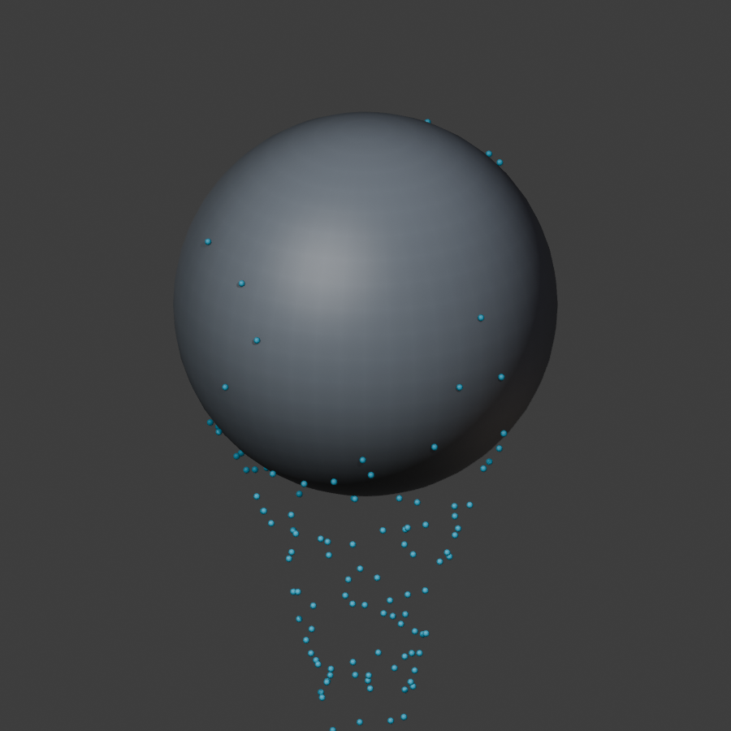

# Flumen

Experimental **Blender 5.2 LTS Geometry Nodes** surface flow and drips, version 0.0.2.

Two workflows are available: static drainage paths, and animated particles with surface resistance, adhesion, detachment, collision, and native baking. The animated workflow is a procedural approximation inspired by *A Practical Guide to Thin Film and Drips Simulation* (SIGGRAPH 2019). It does not implement the paper's FLIP/APIC solver or liquid films.

## Try the baked demo

Open [Flumen_M1_Demo.blend](artifacts/Flumen_M1_Demo.blend). Play or scrub frames **1-72**. Choose Sphere, Slope, Bottle rim, Opposing sheets, Concave fold, or Suzanne from Blender's scene selector. Bakes are packed into the file; the generated nodes work without installing the add-on. The cyan drops are an opaque diagnostic display, not a water shader.



## Install and create your own

1. In Blender 5.2, use Preferences > Get Extensions > Install from Disk, selecting [flumen-0.0.2.zip](artifacts/flumen-0.0.2.zip).
2. Select a stationary mesh. Set Scene Unit Scale to **1.0** (one Blender unit = one meter). The mesh needs height variation along Gravity; tilt a horizontal plane before setup.
3. Open 3D View > Sidebar > Flumen. Choose **Create Animated Flow**, or **Build Flumen** for static paths.
4. For animation, keep the new water host unparented with identity transforms. Tune inputs in its Geometry Nodes modifier and play sequentially from the start frame.
5. Save the file, then use the host's native **Simulation Nodes bake** controls. Choose Packed for a portable file. Bake before jumping between frames or rendering out of order.

After changing collision geometry, source, gravity, resistance, time range/FPS, or other simulation controls: delete **this host's** bake/cache, return to the start frame, and replay/rebake. Material changes are downstream of stored state and do not require recomputing particle motion. Each host has independent state.

Development installation remains available through `scripts/install_dev.py` in Blender's Text Editor.

## Scope and limits

- Static paths retain the original workflow. Rebuild preserves socket IDs, modifier values, drivers, and external links, and rolls back on candidate failure.
- Animated M1 seeds once, caps the budget at 2,048 particles, and uses 8-64 adaptive substeps by default. Seed density is conservatively capped using total surface area; a narrow source can seed fewer particles than its budget. Particle age is seconds; static trail age is an iteration index.
- Collision meshes must remain stationary throughout the simulation. Animated transforms, deformation, and changing topology are unsupported. Do not move the water host.
- Attached drops use tangent gravity with linear drag. Free drops use ballistic integration with a radius-extended ray and proximity clearance. This is approximate collision, particularly around sharp edges and grazing contacts.
- Travel clamps prevent large jumps when the substep cap is insufficient; `sf_step_limited` reports the resulting loss of accuracy. `Diagnostics` exposes volume totals, particle counts, blocked/limited counts, and actual substeps.
- No merging, continuous emission, persistent animated trails, wetness, films, or moving-surface transport in M1. These remain gated future work.
- Performance depends heavily on geometry and adaptive substeps. See measured results in [Implementation status](docs/IMPLEMENTATION_STATUS.md); the 100 ms preview target is not a guarantee.

## Build and verify

```text
python -m pytest -q
blender --background --factory-startup --python-exit-code 1 --python scripts/run_blender_tests.py
python scripts/build_extension.py artifacts/extension-stage
blender --background --factory-startup --command extension validate artifacts/extension-stage
blender --background --factory-startup --python-exit-code 1 --python scripts/smoke_test_blender.py -- --package artifacts/extension-stage
blender --background --factory-startup --command extension build --source-dir artifacts/extension-stage --output-dir artifacts
```

Use a new staging directory each time. `flumen/` is canonical; `flumen/` is its distribution mirror. See [Testing](docs/TESTING.md), [Algorithm](docs/ALGORITHM.md), and the [implementation plan](docs/superpowers/plans/2026-09-24-geometry-nodes-drips.md).
