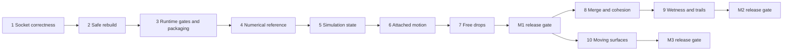

# Geometry Nodes Drainage and Drips Implementation Plan

> **For agentic workers:** REQUIRED SUB-SKILL: Use superpowers:subagent-driven-development or superpowers:executing-plans to implement this plan task-by-task. Steps use checkbox (`- [ ]`) syntax for tracking. Execution method: native execution, authorized by the user for M0-M1. M2/M3 remain unselected.

**Goal:** Adapt the reference paper's surface-water behavior into an editable, bakeable Geometry Nodes approximation with tested attachment, detachment, merging, wetness, and bounded motion support.

**Architecture:** Repair the existing static path builder first. Add an independent Simulation Zone graph carrying particle state, with a Repeat Zone for bounded substeps and modular groups for attached motion, free flight, merging, wetness, and output. Introduce moving-surface correspondence only after stationary-surface behavior is proven.

**Tech Stack:** Blender 5.2.0+, Geometry Nodes, Blender Python API, Python 3.11+, pytest for pure math, standard-library unittest for Blender runtime tests.

**Spec:** [Geometry Nodes drips design](../specs/2026-09-24-geometry-nodes-drips-design.md). Read it before executing any task; equations and acceptance thresholds there are normative.

**Status:** M0-M1 implemented; final evidence is recorded in [Implementation status](../../IMPLEMENTATION_STATUS.md). This task recipe is retained as the original planning record. Detailed execution substitutions and review fixes are in `.superpowers/sdd/2026-09-24-geometry-nodes-drips/progress.md`. M2/M3 are not implemented.

## Execution record - selected M0-M1 delivery

| Task | Delivery status |
|---|---|
| 1 | Complete: socket and static propagation regressions pass |
| 2 | Complete: transactional rebuild, behavioral validation, preservation and rollback pass |
| 3 | Complete locally: canonical package, staged smoke, ZIP validation; hosted Blender CI is configured but unexecuted |
| 4 | Complete for M1: drag/free-flight oracles; M2 merge/wetness functions deferred |
| 5 | Complete: real Simulation Zone, bounded source, setup validation, reset and host isolation |
| 6 | Complete: attached motion, adhesion, support loss, locality and travel bounds |
| 7 | Complete: free motion, approximate contact, reattachment, volume removal and display |
| 8-10 | Deferred: outside selected milestone |
| 11 | M1 delivery: packed bake roundtrip, six scenes, benchmark matrix, package and documentation |

The detailed unchecked boxes below preserve the original task recipe, including illustrative APIs and later-milestone requirements. Use this table and the acceptance checklist for delivered status; execution substitutions are documented in the ledger.

## Global Constraints

- Blender minimum: 5.2.0.
- Pure Python minimum: 3.11.
- Runtime dependencies: Blender and the Python standard library only.
- Simulation updates run in Geometry Nodes; Python builds graphs, validates setup, and runs tests. No Python frame handlers.
- Coordinates: an unparented, identity-transform simulation host; one Blender unit equals one meter; `scene.unit_settings.scale_length == 1.0`.
- Gravity is world-space acceleration in meters per second squared in animated mode; legacy static Gravity remains a direction.
- Preserve existing static node-group interface identifiers and modifier settings.
- Source of truth: `flumen/`; generate extension Python files from it before packaging.
- Determinism is required for a fixed Blender build, mesh, seed, controls, frame rate, and substep count. Cross-version bake compatibility is not promised.
- Invalid or unsupported input produces a visible setup error or simulation diagnostic, never an apparently successful empty result without explanation.

## Review Focus

1. Duplicate socket names and inactive typed sockets must never replace the intended operand: Task 1.
2. A second object, rebuild, or save/reload must not erase an existing object's values, links, or drivers: Task 2.
3. Empty geometry, singleton particle sets, zero dt, and invalid samples must stay finite and deterministic: Tasks 4–7.
4. Nearby opposing surfaces and concave folds must not exchange attached particles or wetness: Tasks 6 and 9.
5. Frame jumps, source transforms, and same-count topology changes must not silently corrupt cached state: Tasks 5, 10, and 11.

## Milestones, dependencies, and estimate

| Milestone | Tasks | Independently reviewable result | Engineering estimate |
|---|---|---|---|
| M0 | 1–3 | Reliable static paths and a reproducible extension | 1–2 days |
| M1 | 4–7, then Task 11's M1 gate | Animated attached flow and free drops on stationary meshes | 4–7 days |
| M2 | 8–9, then Task 11's M2 gate | Channels, volume-safe merges, bounded wetness and trails | 3–5 days |
| M3 | 10, then Task 11's M3 gate | Rigid/deforming surface support with invariant topology | 3–5 days |

Estimates are for an engineer familiar with Geometry Nodes, including debugging and visual inspection. They are not elapsed-time promises. Task 11's verification work is included in each estimate. The geometric gates may expose a need to narrow supported input geometry.



Do not execute M2 and M3 concurrently against the same integration file. If delegated, give each task ownership of its module and serialize changes to the shared graph orchestrator.

## File ownership and interfaces

| Path | Responsibility |
|---|---|
| `flumen/node_utils.py` | Explicit socket resolution and basic linking |
| `flumen/build_nodes.py` | Repaired legacy static graph and stable interface |
| `flumen/math_core.py` | Existing static-path reference math |
| `flumen/sim_math.py` | New numerical reference functions |
| `flumen/sim_schema.py` | Attribute names, states, input bounds, schema version |
| `flumen/build_simulation.py` | Top-level Simulation/Repeat Zones and state wiring |
| `flumen/sim_source.py` | Source initialization |
| `flumen/sim_attached.py` | Attached integration and support tests |
| `flumen/sim_free.py` | Free flight, collision, lifetime, volume removal |
| `flumen/sim_merge.py` | Reciprocal-pair merging and cohesion |
| `flumen/sim_wetness.py` | Persistent proxy wetness |
| `flumen/sim_output.py` | Bounded trails, drop instances, visual coating |
| `flumen/sim_motion.py` | Previous/current surface correspondence |
| `flumen/operators.py`, `ui.py`, `__init__.py` | Creation/validation and panel integration |
| `scripts/run_blender_tests.py` | Standard-library runtime test runner |
| `tests/blender/helpers.py` | Fixture creation, modifier inputs, output probes, frame stepping |
| `tests/blender/test_*.py` | Actual graph behavior tests |
| `tests/test_sim_math.py` | Pure numerical tests |
| `scripts/build_extension.py` | Staged extension assembly from canonical source |
| `scripts/benchmark_blender.py` | Reproducible timing and memory report |

Existing source locations are orientation aids: socket resolution is currently `node_utils.py:11`; group rebuild starts near `build_nodes.py:119`; attached propagation near `build_nodes.py:254`; operator entry is `operators.py:23`. Locate by symbol after edits.

## Execution conventions

The supplied folder has no `.git` metadata. Do not run commits or create a worktree until the user provides/authorizes a Git checkout. In a Git checkout, make one focused commit at the end of each passing task. In this folder, record the task's files and verification in the execution log instead.

Use these PowerShell commands from the repository root:

```powershell
$blender = 'C:/Program Files/Blender Foundation/Blender 5.2/blender.exe'
python -m pytest tests/test_math_core.py tests/test_sim_math.py -q
& $blender --background --factory-startup --python-exit-code 1 --python scripts/run_blender_tests.py -- --pattern test_attached.py
```

Run only files already introduced by completed tasks. Blender tests use unittest so Blender's bundled Python does not require pytest. `--python-exit-code 1` is mandatory; Python exceptions must fail the command.

Each task follows a test-first cycle: add the specified failing case, observe the expected failure, implement the bounded change, run the targeted case and relevant earlier gates, then record/commit. Code below specifies contracts and test kernels; graph builders must implement the explicit node recipes alongside them. A test kernel using a later fixture is placed only in that fixture's owning task.

### Task 1: Correct socket identity and prove static propagation

**Files:** Modify `flumen/node_utils.py`, `flumen/build_nodes.py`, `pyproject.toml`; create `scripts/run_blender_tests.py`, `tests/blender/__init__.py`, `tests/blender/helpers.py`, `tests/blender/test_static_graph.py`.

**Interfaces:** `resolve_socket(sockets, *, name: str | None = None, index: int | None = None, identifier: str | None = None)` returns one socket or raises `ValueError`. `build_flumen_group(force_rebuild=True)` retains its public signature. Helpers expose `set_input_value(modifier, name, value)`, `evaluate_points(obj, output_name) -> list[dict]`, and `build_static_sphere(**inputs) -> Object`.

- [ ] Add a unittest runner using `unittest.defaultTestLoader.discover('tests/blender', pattern=args.pattern, top_level_dir='tests/blender')`; raise `RuntimeError` unless `result.wasSuccessful()`. Add a helper that reads interface socket identifiers and writes Blender 5.2 values through `getattr(modifier.properties.inputs, identifier).value`; do not use unsupported `modifier[identifier]` writes.
- [ ] Separate pure and Blender collection immediately: add `norecursedirs = ["blender"]` under `[tool.pytest.ini_options]`. Confirm `python -m pytest tests --collect-only -q` discovers only pure tests while the Blender runner discovers its runtime tests.
- [ ] Add failures that link two separate Vector Math operands and two separate Math operands. Include an unavailable identifier and ambiguous name. The test must inspect socket links, not node labels alone.

```python
def test_duplicate_math_operands(self):
    a = self.tree.nodes.new('ShaderNodeMath')
    first = resolve_socket(a.inputs, index=0)
    second = resolve_socket(a.inputs, index=1)
    self.assertNotEqual(first.as_pointer(), second.as_pointer())
    with self.assertRaises(ValueError):
        resolve_socket(a.inputs, name='Value')
```

- [ ] Run `test_static_graph.py`; observe the missing resolver/incorrect operand failure. Implement identifier lookup first, explicit index second, unique available-name lookup last. Multiple selectors are an error; do not silently choose one. Require compatible, available sockets. Change each duplicate operand call to an explicit selector; do not globally prioritize old fallback indices, since some fallbacks are only version aliases.
- [ ] Add debug outputs `Seeds` and `Trails` to the static graph. `evaluate_points` uses a temporary wrapper group to route a selected output through Points to Vertices, evaluates attributes, then removes its own temporary objects/groups. The helper must not alter the source group or normal modifier outputs.
- [ ] Add sphere assertions: changing Source Start from 0.3 to 0.9 changes the seed distribution; at Randomness=0 and 8 steps, paths from sloped upper faces move downward by more than `1e-3 m`; trail ages are integers 0–8; IDs retain 9 samples each. Test constant-height geometry and Source Softness=0 separately.
- [ ] Normalize every sampled surface normal before tangent projection; implement the explicit hard threshold for zero softness. Run static runtime tests and `python -m pytest tests/test_math_core.py -q`. Record the four original symptoms as fixed only after their graph checks pass.

### Task 2: Preserve values, links, and drivers through rebuild

**Files:** Modify `flumen/build_nodes.py`, `flumen/operators.py`; create `tests/blender/test_rebuild.py`.

**Interfaces:** `build_flumen_group(force_rebuild=False)` returns the existing complete group without mutation. Rebuild preserves its interface identifiers. `build_static_implementation() -> GeometryNodeTree` builds a new owned child group; the existing group becomes a stable outer wrapper. A candidate graph is checked before the wrapper switches active output; failure leaves the old graph usable.

- [ ] Add the existing regression reproducer as a test: set Steps to 7, rebuild, assert 7. Include two objects with different values, a parent group link, and an input driver. Save and reload a temporary `.blend` before the final assertions.

```python
old_ids = {(s.in_out, s.name): s.identifier for s in tree.interface.items_tree
           if s.item_type == 'SOCKET'}
set_input_value(mod_a, 'Steps', 7)
set_input_value(mod_b, 'Steps', 13)
build_flumen_group(force_rebuild=True)
self.assertEqual(read_input_value(mod_a, 'Steps'), 7)
self.assertEqual(read_input_value(mod_b, 'Steps'), 13)
self.assertEqual(interface_ids(tree), old_ids)
```

- [ ] Define `read_input_value(modifier, name) -> object` and `interface_ids(tree) -> dict[tuple[str,str],str]` in helpers; include direction in each key so Geometry input and output do not collide. Run `test_rebuild.py` and confirm the original reset fails.
- [ ] Keep the interface when its schema is compatible. Ordinary Build defaults to reuse. Build replacement internals in `build_static_implementation()` as an owned child group, then validate with a temporary fixture. Add a candidate branch to the existing wrapper and switch its active output only after the candidate passes. Preserve the prior branch until wrapper evaluation succeeds, restoring its active output on failure. Remove obsolete owned nodes/groups only after success and when unused. Exercise rollback by injecting both a construction exception and a validation failure.
- [ ] Assert two reuse calls leave node count and active output unchanged. Assert Build on object B does not change object A. Preserve distinct unrelated modifiers even when names collide; identify owned modifiers using a custom property and node-group identity.
- [ ] Run `test_rebuild.py` and `test_static_graph.py`. Record schema version and compatibility rules in `docs/ARCHITECTURE.md` and `docs/TESTING.md`.

### Task 3: Make runtime tests and packaged sources meaningful

**Files:** Modify `scripts/smoke_test_blender.py`, `.github/workflows/tests.yml`, `docs/TESTING.md`; create `scripts/build_extension.py`, `tests/test_distribution.py`, `tests/blender/test_smoke_contract.py`; synchronize `extension/*.py` from canonical source.

**Interfaces:** `build_extension(stage_dir: Path) -> Path` stages canonical Python modules plus `extension/blender_manifest.toml` and `LICENSE`, returning the extension root. It never overwrites a user-selected directory outside its validated staging root.

- [ ] Add a runtime failure where the flow output is disconnected. Require actual debug trail samples, expected age ranges, and movement; a non-null mesh is not success.
- [ ] Implement smoke assertions using Task 1 helpers and ensure the deliberate disconnect now fails. Save `.blend` output only when `--save PATH` is provided.
- [ ] Add a distribution test comparing staged module bytes with `flumen/`, checking required manifest/license presence and excluding bytecode, tests, and temporary data.

```python
for path in Path('flumen').glob('*.py'):
    assert (stage / path.name).read_bytes() == path.read_bytes()
assert (stage / 'blender_manifest.toml').is_file()
assert (stage / 'LICENSE').is_file()
assert not list(stage.rglob('*.pyc'))
```

- [ ] Implement staging with `pathlib` and `shutil.copy2`; use a new temporary staging directory on every build. Validate the staged manifest with Blender's extension command and run the same import/build smoke against the staged package.
- [ ] Keep pure tests in the existing CI job. Add a separate runtime job using a pinned Blender 5.2 distribution with a verified checksum; fail on download or version mismatch. Document the exact version and the local equivalent. Do not commit a guessed download URL/checksum: resolve and verify official release metadata when this task executes.
- [ ] Pass the M0 gate before proceeding. Update `docs/IMPLEMENTATION_STATUS.md` with executed evidence rather than declaring planned features implemented.

### Task 4: Define numerical reference functions and state contract

**Files:** Create `flumen/sim_math.py`, `flumen/sim_schema.py`, `tests/test_sim_math.py`.

**Interfaces:** All vectors are 3-tuples of finite floats. `attached_step(anchor, relative_velocity, normal, gravity, drag_rate, dt) -> tuple[Vec3, Vec3]`; `free_step(position, velocity, gravity, dt) -> tuple[Vec3, Vec3]`; `merge_pair(volume_a, velocity_a, volume_b, velocity_b) -> tuple[float, Vec3]`; `wetness_step(wetness, deposit_rate, drying_rate, dt) -> float`. Invalid finite/range checks raise `ValueError`; dt=0 returns unchanged state.

- [ ] Write plane/drag/free-flight tests before code. Use a unit normal and unnormalized tangential gravity. Test drag=0 and positive drag, zero gravity, invalid normal, negative dt, nonfinite data, and volume accounting.

```python
def test_free_fall_exact_step():
    p, v = free_step((0, 0, 1), (0, 0, 0), (0, 0, -9.81), 0.1)
    assert p == pytest.approx((0, 0, 0.95095))
    assert v == pytest.approx((0, 0, -0.981))

def test_merge_conserves_volume_and_momentum():
    volume, velocity = merge_pair(1e-9, (1, 0, 0), 3e-9, (0, 0, 0))
    assert volume == pytest.approx(4e-9, rel=1e-12, abs=0)
    assert velocity == pytest.approx((0.25, 0, 0))
```

- [ ] Run `python -m pytest tests/test_sim_math.py -q` and observe missing-function failures. Implement the analytic equations from spec §7. Use numerically stable scalar helpers around small drag*dt; verify the zero-drag limit instead of dividing by zero.
- [ ] Define schema constants exactly as spec §6. Add state constants `ATTACHED=0`, `FREE=1`, `SIM_SCHEMA_VERSION=1`; define `SIM_NODE_GROUP_NAME='SF_SurfaceFlowSim'`. Keep legacy attribute semantics isolated.
- [ ] Compare one second of slope motion at 24 and 48 fps against the analytic result. Require `1e-5 m` reference error. Add a shallow-slope test that would fail if acceleration were normalized.
- [ ] Run all pure tests. Record the exact mathematical oracle and units in `docs/ALGORITHM.md` without claiming the node graph already implements it.

### Task 5: Build Simulation Zone initialization, state, and reset

**Files:** Create `flumen/build_simulation.py`, `flumen/sim_source.py`, `tests/blender/test_sim_state.py`; modify `scripts/inspect_node_api.py`, `tests/blender/helpers.py`, `flumen/operators.py`, `ui.py`, `__init__.py`.

**Interfaces:** `build_simulation_group(force_rebuild=False) -> GeometryNodeTree`; `build_source_group() -> GeometryNodeTree`; `create_simulation_host(source_object) -> Object`. Helpers add `create_sim_fixture(kind, **settings) -> Object`, `step_frames(host, start, end) -> list[list[dict]]`, `read_particles(host) -> list[dict]`. Initial supported fixture kinds: `plane`, `slope`, `sphere`, `underside`, `thin_wall`, `opposing_sheets`, `concave_fold`.

- [ ] Extend the live API inspection script to pair Simulation and Repeat nodes before enumerating dynamic sockets. Print identifiers, types, availability, and bake properties. Verify one state item survives a two-frame pass-through graph before building production groups.
- [ ] Add initialization tests: repeatable seeds, stable IDs, one-time emission, maximum budget, transformed source coordinates, empty mesh, no faces, zero density, and zero dt. Test reset by clearing the test's own cache and replaying from its start frame.

```python
host = create_sim_fixture('sphere', seed=17, budget=64)
first_run = step_frames(host, 1, 4)
reset_simulation(host)
second_run = step_frames(host, 1, 4)
self.assertEqual([p['sf_id'] for p in first_run[0]],
                 [p['sf_id'] for p in second_run[0]])
self.assertLessEqual(len(first_run[0]), 64)
```

- [ ] Define `reset_simulation(host) -> None` in test helpers using inspected native cache operations with an explicit object context. Run `test_sim_state.py` and observe absent-builder failures.
- [ ] Build the top-level graph: Object Info relative geometry, Realize Instances, triangulated collision input, one-time source geometry, Simulation Input/Output paired state, and a Repeat Zone with explicit `dt=Delta Time/substeps`. Carry particles unchanged until Task 6. Expose a `Particles` debug output independent of render output.
- [ ] Source group: normalized height mask, density clamped by area/budget, Distribute Points on Faces, deterministic count truncation, Store Named Attribute for each state field. Initialize zero velocity and age, positive volume from Drop Radius, attached state, normalized normals, anchors, island identity, and unique path IDs.
- [ ] Add a Create Animated Flow operator that validates source mesh, units, host transform, and finite controls. Do not modify source transforms or visibility. Add the panel action and a compact diagnostic label; keep native baking UI. Run static tests to prove this new path does not alter legacy modifiers.
- [ ] Gate: if sequential Simulation Zone evaluation or reset is unreliable in the headless harness, stop here with the minimal failing `.blend`; do not implement downstream features against a fake state evaluator.

### Task 6: Integrate attached flow and bounded adhesion

**Files:** Create `flumen/sim_attached.py`, `tests/blender/test_attached.py`; modify `build_simulation.py`, `sim_schema.py`, `tests/blender/helpers.py`.

**Interfaces:** `build_attached_group() -> GeometryNodeTree` with sockets from spec §5. Inputs include `dt`, Gravity, Resistance, Adhesion Acceleration, Capture Distance, Max Travel, and Normal Turn Limit. Outputs preserve all particle attributes and set `sf_blocked`/detachment state.

- [ ] Add graph-vs-reference tests on a plane and slope, using exact seed injection into a fixture-only wrapper so random placement cannot hide errors. Define helper `inject_particles(host, records) -> None` in the test wrapper; production graph source remains unchanged.

```python
host = create_sim_fixture('slope', resistance=5.0, cohesion=0.0)
inject_particles(host, [particle_at((0, 0, 0.5), volume=1e-9)])
actual = step_frames(host, 1, 25)[-1][0]
self.assertLess(actual['position'][2], 0.5)
self.assertLess(actual['surface_distance'], 1e-4)
```

- [ ] Define `particle_at(position, *, volume, velocity=(0,0,0), state=0) -> dict` in helpers and derive the correct fixture anchor/normal before injection. Test the exact same simulation interval against `attached_step`; align elapsed time with Simulation Delta Time, not an assumed count of evaluated frames.
- [ ] Build vector math for tangent projection and analytic drag, with explicit operand socket indices. Implement spec §7.1's small-`k*dt` polynomial branch with Switch and guarded denominators; include single-precision cancellation tests at drag rates `0`, `1e-6`, `1e-3`, and `5`. Sample position and normal using island Group IDs, capture outputs in the particle context, normalize normals, and consume `Is Valid`.
- [ ] Implement projection acceptance: capture distance, travel bound, normal-turn bound, island identity, and the explicit tangential-residual continuation test. On rejected projection, hold the anchor and zero relative velocity unless detachment applies. Add opposing-sheet and concave-fold tests; a failed locality test is a release blocker, not a reason to raise tolerances.
- [ ] Implement underside detachment and rim loss of support per spec §7.2. Test Adhesion Acceleration values below and above 9.81 m/s² on a downward-facing plane, and a slow particle crossing an open rim whose per-step travel is smaller than Capture Distance. Split `sf_path` on state transition, allocating IDs with Accumulate Field over transition flags plus the carried next-ID counter. Capture state at substep start so no newly detached particle receives two integrations in one substep.
- [ ] Add adaptive substep count from maximum speed/acceleration, bounded to 64. Record `sf_step_limited` and deterministic displacement clamping when the bound is exceeded. Test empty particles, zero dt, and extreme valid velocity.
- [ ] Run `test_attached.py`, `test_sim_state.py`, and numerical tests. Save slope/underside/concave debug scenes only to the test artifact directory.

### Task 7: Add free flight, collision, and volume removal

**Files:** Create `flumen/sim_free.py`, `flumen/sim_output.py`, `tests/blender/test_free.py`; modify `build_simulation.py`, `sim_schema.py`.

**Interfaces:** `build_free_group() -> GeometryNodeTree`; `build_output_group() -> GeometryNodeTree`. Free group outputs particles and volume removed in this substep. Output group initially displays drops as instances using radius derived from volume; tests read particles, not the instance mesh.

- [ ] Add graph-vs-reference free-fall tests, zero velocity, zero dt, lifetime removal, Kill Height removal, and attached-to-free velocity continuity.

```python
expected_p, expected_v = free_step((0, 0, 1), (0, 0, 0), (0, 0, -9.81), 0.1)
actual = evaluate_free_step_fixture(position=(0,0,1), velocity=(0,0,0), dt=0.1)
assert_vector_close(self, actual['position'], expected_p, tolerance=1e-4)
assert_vector_close(self, actual['sf_velocity'], expected_v, tolerance=1e-4)
```

- [ ] Define `evaluate_free_step_fixture(...) -> dict` and `assert_vector_close(...)` in helpers using a wrapper around the actual step group. Observe failure before adding the free group.
- [ ] Use original substep state to select attached/free processing and join results only after both branches finish. A newly reattached drop starts attached integration next substep. Add a state-transition test that measures elapsed displacement and catches double integration.
- [ ] Implement analytic free flight with Vector Math and Set Position. Raycast source=old position, direction=candidate-old position, length=segment length; bypass zero-length rays. Consume `Is Hit` before any hit data. Correct finite-radius clearance with a validated proximity sample.
- [ ] Apply Capture Speed and normal response from spec §7.3. Carry tangential velocity into reattachment, update anchor/island/normal, and create a new path segment. Test a thin wall, a rim, an oblique graze, and collision near two close surfaces.
- [ ] Sum deleted particle volumes with Attribute Statistic before Delete Geometry and add to the cumulative ledger. Require `initial_volume == live_volume + removed_volume` within relative `1e-5`; do not use a large absolute tolerance that masks nanoliter-scale errors.
- [ ] Build drop instances and test radius scaling: doubling volume multiplies radius by `2**(1/3)`. Add replay and a native bake roundtrip in Task 11. Pass the M1 release gate before adding M2 features.

### Task 8: Implement deterministic pair merges and bounded cohesion

**Files:** Create `flumen/sim_merge.py`, `tests/blender/test_merge.py`; modify `sim_math.py`, `tests/test_sim_math.py`, `build_simulation.py`.

**Interfaces:** `build_merge_group() -> GeometryNodeTree`. Consumes attached particle geometry and collider; returns particles with survivor IDs and conserved volume. Free particles bypass this group unchanged.

- [ ] Add two-particle, three-particle, singleton, empty-domain, symmetric-distance, and different-island fixtures. Assert survivor count, stable survivor ID, volume, momentum before tangent projection, and no double consumption.

```python
before = [particle_at((0,0,0), volume=1e-9),
          particle_at((0.001,0,0), volume=3e-9)]
after = evaluate_merge_fixture(before, merge_distance=0.002)
self.assertEqual(len(after), 1)
self.assertAlmostEqual(after[0]['sf_volume'] / 4e-9, 1.0, places=5)
```

- [ ] Define `evaluate_merge_fixture(records, *, merge_distance) -> list[dict]` in helpers. Assign distinct stable IDs during fixture injection. Run `test_merge.py` and observe missing-group failure.
- [ ] Use Index of Nearest on the attached point domain, grouped by island. Verify self exclusion and `Has Neighbor` in a dedicated live test. Capture original index, neighbor index, and partner attributes before modifying geometry. Use Sample Index to test reciprocal pairing; compare stable IDs to choose the survivor.
- [ ] Validate distance, normal agreement, and midpoint projection before accepting a pair. Store weighted position/velocity and summed volume on survivors, then delete consumed particles. Preserve nonpairs. Test that two nearby sides of a fold do not merge through the surface.
- [ ] Add optional cohesion acceleration projected onto the tangent plane, with distance falloff and an explicit cap. Default it to zero; an attraction-only test must converge without increasing speed beyond the integration bound. Do not claim physical surface tension.
- [ ] Run merge, attached, free, and volume-ledger tests. Verify determinism with repeated cold runs in the same Blender build; document tie behavior rather than promising cross-version ordering.

### Task 9: Persist wetness, bound trails, and render a coating

**Files:** Create `flumen/sim_wetness.py`, `tests/blender/test_wetness.py`, `tests/blender/test_trails.py`; modify `sim_output.py`, `build_simulation.py`, `sim_schema.py`.

**Interfaces:** `build_wetness_group() -> GeometryNodeTree`; extend output group with `Trails` and `Wetness Proxy` geometry inputs. Simulation state adds persistent proxy wetness and bounded trail geometry.

- [ ] Add tests for deposition, persistence after the droplet leaves, drying, clamping, empty attached input, separate islands, and proxy vertex-budget rejection. Require that a zero-particle frame never samples an invalid neighbor as a real contact.

```python
self.assertEqual(wetness_step(0.5, 0.0, 0.1, 1.0), 0.4)
self.assertEqual(wetness_step(0.9, 5.0, 0.0, 1.0), 1.0)
self.assertEqual(wetness_step(0.1, 0.0, 1.0, 1.0), 0.0)
```

- [ ] Mirror these cases in the actual wetness group; compare float results with tolerances. Use Geometry Proximity in points mode with Group IDs and `Is Valid`, then map distance to deposition. Update stored wetness each numerical substep. Blur only through mesh connectivity, with 0–4 bounded iterations.
- [ ] Add trail tests across detach and reattach: independent path IDs, monotonic ages per path, no curve spanning a free-flight gap, no redundant stationary samples, deterministic eviction beyond frame/sample budgets.
- [ ] Capture attached positions once per frame after merges, join to trail state, remove expired samples, and enforce the 300,000-sample hard ceiling. Group Points to Curves by `sf_path` and order by `sf_age`. Treat merged child trails as historical geometry, never active volume.
- [ ] Add an offset coating mesh with `sf_wetness` and a material driven by that field. Source remains separately visible; output only the coating, channels, and drops. Cap thickness; expose appearance controls downstream from the simulation. Ensure no source/host dependency cycle.
- [ ] Run wetness/trail tests and all M1/merge gates. Render sphere, bottle, and head fixtures for visual assessment. Pass M2 only if channels and wetness are useful at the documented proxy resolution; screenshots alone do not satisfy volume or memory gates.

### Task 10: Add moving-surface correspondence behind its gate

**Files:** Create `flumen/sim_motion.py`, `tests/blender/test_motion.py`; modify `build_simulation.py`, `sim_attached.py`, `sim_free.py`, `sim_wetness.py`, `sim_output.py`.

**Interfaces:** `build_motion_group() -> GeometryNodeTree` consumes Previous Collision, Current Collision, particles, and frame dt. Produces transported anchors, surface velocity, interpolated collision state for substeps, and a topology-valid flag. Update Previous Collision only at frame completion.

- [ ] Build a minimal correspondence fixture first: translate a triangulated plane by 0.1 m between frames; use Sample Index to put current Position on previous vertices; Sample Nearest Surface on the previous mesh must transport an anchor by exactly that displacement. Require <=`1e-5 m` error.
- [ ] Add rotation, accelerating translation, and fixed-topology deformation tests. Add a same-count connectivity-change fixture, not only a vertex-count change. Validate all relevant connectivity using corner-to-vertex mappings and per-face corner counts; verify the required corner sampling node APIs locally before wiring them. Document that stable vertex identity is an input requirement even when connectivity does not change.

```python
before, after = evaluate_translated_contact_fixture(displacement=(0.1,0,0))
assert_vector_close(self, subtract(after['sf_anchor'], before['sf_anchor']),
                    (0.1,0,0), tolerance=1e-5)
self.assertTrue(evaluate_rewired_mesh_fixture()['sf_invalid_topology'])
```

- [ ] Define `evaluate_translated_contact_fixture(...)`, `evaluate_rewired_mesh_fixture()`, and vector subtraction in helpers. A failed correspondence or topology gate stops M3 implementation and preserves M1/M2's stationary limitation.
- [ ] Implement vertex-position interpolation across substeps. Compute surface velocity from corresponding anchors over frame dt with a zero-dt guard. Store `sf_surface_velocity`, derive approximate boundary acceleration, and use it in the relative acceleration/adhesion tests specified in §8. Rotate relative velocity between normals; stop relative velocity for an ambiguous 180-degree normal flip. Reproject tangentially and add boundary velocity.
- [ ] Test that detaching from a moving surface retains its translational velocity; reattachment subtracts the surface velocity before tangential retention. Transport wetness by stable proxy indices and reconstruct retained trail sample positions by the same material correspondence so old trails do not remain behind in space.
- [ ] On topology mismatch, freeze the last valid state, set `sf_invalid_topology`, and display reset guidance. Do not consume arbitrary current indices. Run translation, rotation, deformation, detach/reattach, and topology fixtures plus all prior milestone gates.

### Task 11: Verify baking, performance, visuals, and distribution per milestone

**Files:** Create `tests/blender/test_bake.py`, `scripts/benchmark_blender.py`, `examples/create_validation_scenes.py`; modify `README.md`, `docs/TESTING.md`, `docs/ALGORITHM.md`, `docs/IMPLEMENTATION_STATUS.md`, `docs/ROADMAP.md`, `docs/REFERENCES.md`, `extension/blender_manifest.toml`, and staged extension modules.

**Interfaces:** Benchmark CLI: `--particles 512 --faces 2000 --frames 240 --fps 24 --substeps 8 --output PATH`. Writes JSON with Blender version, CPU, graph schema, timing, memory, actual substep distribution, particle/trail maxima, and volume error. `--faces` is a target; report actual face count.

- [ ] Add a bake test that saves a temporary scene, steps frames sequentially, uses Blender's native bake operation with an explicit active-object override, reopens the scene, and reads frames out of order. Compare IDs, positions, state, and volume to the sequential record within spec tolerances. Store caches only in the test's temporary directory.
- [ ] Add a settings-change test requiring cache reset; distinguish presentation-only changes from state-driving input changes. Verify two simulation hosts have independent state and cache paths. Do not delete caches belonging to other objects or outside the test directory.
- [ ] Implement benchmark frame timing with `time.perf_counter()` and process memory using platform-supported OS facilities, without adding a runtime package dependency. Report unavailable memory measurement explicitly. Run the 2x2 particle/mesh matrix from spec §10 and include actual hardware; do not claim the proposed 100 ms preview target is already achieved.
- [ ] Generate deterministic validation scenes for a sphere, slope, bottle rim, opposing sheets, concave fold, and Suzanne/head. For M3 add animated translation, rotation, and deformation. Save cameras/materials and the controls used so images can be compared across revisions.
- [ ] Stage and validate the extension using Task 3; test installation/import and the milestone's graph from staged files. Update version and documentation only for completed milestones. Preserve the static workflow and record cache/schema compatibility.
- [ ] Run release commands appropriate to the milestone:

```powershell
python -m pytest tests -q
& $blender --background --factory-startup --python-exit-code 1 --python scripts/run_blender_tests.py -- --pattern 'test_*.py'
& $blender --background --factory-startup --python-exit-code 1 --python scripts/benchmark_blender.py -- --particles 512 --faces 2000 --frames 240 --fps 24 --substeps 8 --output artifacts/benchmark-m1.json
```

Pure pytest excludes `tests/blender/` through Task 1's `norecursedirs` configuration; never import Blender tests in system Python. Do not run absent later-milestone test files as though they had passed.

- [ ] Record failures, numerical results, and visual limitations in the release note. Stop after the selected milestone passes. Before any implementation begins, the user reviews this plan and selects native execution or subagent-driven execution.

## Acceptance checklist

- [x] M0: actual static paths work; rebuild/reuse preserve user work; staged extension matches source.
- [x] M1: animated Flumen, resistance, detachment, collision, volume removal, reset, and bake gates pass.
- [ ] M2: reciprocal merging, bounded cohesion, persistent wetness, trail bounds, and coating gates pass.
- [ ] M3: material correspondence, inherited velocity, transported appearance, and topology invalidation gates pass.
- [x] Each shipped milestone (M0-M1) has recorded numerical, runtime, packaging, performance, and visual evidence.

## Planning self-review

This plan maps spec §2 to numerical/visual adaptations in Tasks 4 and 6–10; §4 constraints to setup and release checks; §§5–6 state to Task 5; §7 equations to Tasks 4 and 6–9; §8 motion to Task 10; §9 controls to Tasks 5–10; §10 validation to each task and Task 11; §11 migration to Tasks 2–3. Reference functions do not substitute for Blender runtime tests. No paper-solver fidelity or real-time performance is asserted.

Recommended execution method: native, one task at a time, with milestone reviews. The shared graph/state interfaces make parallel implementation likely to conflict. Independent review can occur after each milestone without having multiple agents edit the same graph builder.
