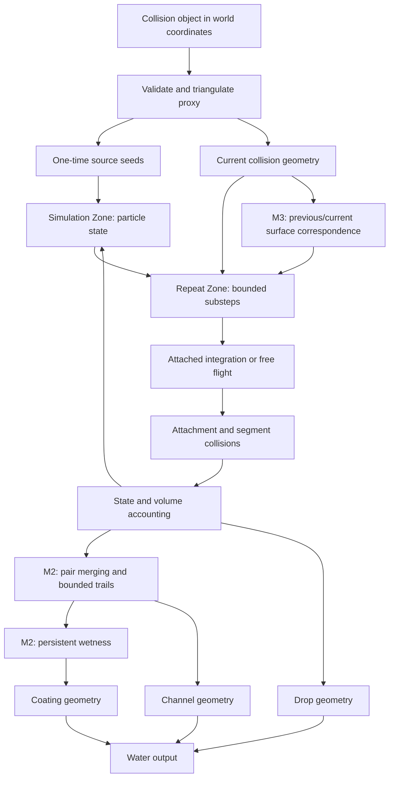

# Flumen: Geometry Nodes drainage and drips design

**Status:** Proposed design for the requested implementation plan. Planning only; no implementation approval or completed features implied.

**User intent:** Adapt `siggraph2019_drips-v2.pdf` to this Blender Geometry Nodes project. Preserve an editable node-based workflow and use the paper as the primary visual and technical reference.

**Confirmed target:** The user selected animated flow and drips with baking. The existing static-path generator remains available. The first release supports stationary collision geometry; motion support has its own acceptance gate.

## 1. Decision and alternatives

| Approach | Benefits | Costs | Decision |
|---|---|---|---|
| Extend static Repeat Zone paths | Smallest change; useful for still images and reveal animation | No time-dependent velocity, detachment dynamics, or moving-boundary behavior | Retain as legacy/static mode |
| Stateful particles constrained to a surface, with free drops | Fits Geometry Nodes; permits drainage, drag, merging, wetness, and baking | Adhesion and cohesion are approximations; requires careful state and sampling | Recommended |
| Reproduce the paper's grid/particle solver | Closest route to its physical method | Pressure and viscosity solves, fluid SDF reconstruction, transfers, and substantial memory/computation | Separate research project; outside this plan |

The recommended implementation is a procedural particle model inspired by the paper. It must not describe itself as FLIP, APIC, a contact-angle solver, or a physically accurate thin-film solver.

## 2. Evidence and reference mapping

Primary reference: Stomakhin, Moffat, and Boyle, *A Practical Guide to Thin Film and Drips Simulation*, SIGGRAPH 2019, DOI `10.1145/3306307.3328141`. [Local PDF](../../../siggraph2019_drips-v2.pdf); [publisher's project PDF](https://www.wetafx.co.nz/assets/Uploads/PDFs/siggraph2019_drips-v2.pdf).

| Paper mechanism | Location | Proposed adaptation | Fidelity |
|---|---|---|---|
| Surface tension through fluid curvature in the pressure solve | Section 2 | Optional short-range attraction between attached particles | Artistic cohesion proxy; no pressure solve |
| Contact-angle SDF extrapolation | Sections 2–3, Algorithm 1 | Finite attachment range and outward acceleration threshold | Adhesion proxy; no contact-angle guarantee |
| Increased viscosity near the solid | Section 2, Figure 2 | Tangential velocity damping from a resistance field | Drag approximation |
| Boundary velocity consistent with solid motion | Section 3 | Previous/current surface correspondence and inherited surface velocity | Kinematic approximation |
| Particle trails used for wetness | Section 3 | Persistent scalar field on a surface proxy | Directly related visual technique |

Algorithm 1 operates on **fluid and solid signed-distance fields**. A nearest-surface distance or normal alone is not sufficient to implement it. No contact-angle slider in degrees will be added under this approximation.

Review evidence from installed Blender 5.2.0:

- The existing socket helper selects the first duplicate name rather than the requested operand. Source Start has no effect; zero-randomness paths do not meaningfully move.
- Rebuilding replaces interface identifiers; a Steps value of 7 becomes 0 on an existing modifier.
- `force_rebuild=False` duplicates the graph, increasing 61 nodes to 122.
- The smoke test still succeeds when generated flow is disconnected.
- Simulation Input/Output, Repeat Input/Output, Sample Nearest Surface, Sample Index, Index of Nearest, Raycast, Mesh Island, Object Info, Blur Attribute, and Accumulate Field instantiate in Blender 5.2.0. This verifies availability, not the proposed simulation's correctness.
- Sample Nearest Surface exposes `Group ID`, `Sample Group ID`, and `Is Valid`; these are useful for restricting samples to a surface island.

Blender references: [Simulation Zone](https://docs.blender.org/manual/en/5.0/modeling/geometry_nodes/simulation/simulation_zone.html), [surface sampling](https://docs.blender.org/manual/en/5.0/modeling/geometry_nodes/mesh/sample/sample_nearest_surface.html), [Geometry Proximity](https://docs.blender.org/manual/en/5.1/modeling/geometry_nodes/geometry/sample/geometry_proximity.html). These published pages explain the concepts; live Blender 5.2 probes define the actual socket/API contract.

## 3. Delivery boundaries

### M0 — Reliable existing paths

Repair the four confirmed bugs, normalize sampled normals, test source selection and actual downhill movement, and make the extension build derive from the same source files. This is an independently useful release.

### M1 — Attached flow and free drops

One-time seeded particles, time-dependent velocity, resistance, bounded surface attachment, detachment, segment collision, finite lifetime, and native Simulation Zone baking. Static, consistently oriented manifold collision meshes are supported. Open sheets are supported only when their normals consistently identify the wet side. Continuous emission, splashes, merging, and film are excluded from M1.

### M2 — Channels and appearance

Deterministic pair merging, short-range attraction, bounded trails, persistent wetness, and a thin visual coating shell. Particle volume is accounted for. Rendered trails and coating are visual outputs, not additional conserved fluid volume.

### M3 — Moving surfaces

Rigid motion and deformation with invariant triangulated topology. Surface correspondence, transported tangent velocity, inherited drop velocity, and topology-change rejection. No changing topology, remeshing, or motion inferred from nearest points on unrelated surfaces.

M2 and M3 begin only after M1 passes its numerical and visual gates. Failure of a motion or sampling feasibility gate does not block shipping M0/M1 with accurately stated limitations.

## 4. Global constraints

- Blender minimum: 5.2.0.
- Pure Python minimum: 3.11.
- Runtime dependencies: Blender and the Python standard library only.
- Simulation updates run in Geometry Nodes; Python builds graphs, validates setup, and runs tests. No Python frame handlers.
- Coordinates: an unparented, identity-transform simulation host; one Blender unit equals one meter; `scene.unit_settings.scale_length == 1.0`.
- Gravity is world-space acceleration in meters per second squared in animated mode; legacy static Gravity remains a direction.
- Preserve existing static node-group interface identifiers and modifier settings.
- Source of truth: `flumen/`; generate extension Python files from it before packaging.
- Determinism is required for a fixed Blender build, mesh, seed, controls, frame rate, and substep count. Cross-version bake compatibility is not promised.
- Invalid or unsupported input produces a visible setup error or simulation diagnostic, never an apparently successful empty result without explanation.

## 5. Object and graph architecture

Keep `SF_SurfaceFlow` as the repaired static graph. Add `SF_SurfaceFlowSim` on a generated mesh object named `Flumen Simulation`, with an Object socket referencing the selected collision mesh.

The simulation host has identity transforms and no parent. Object Info uses relative geometry with instances realized so collision positions are in the host/world frame. A transformed-source fixture must prove this before accepting the graph. Do not apply transforms to the user's source object.

The host outputs water geometry only. The original surface remains visible. Wetness is exported on the generated coating mesh through `sf_wetness`; do not add an Object Info reference from the source back to the host, which would create a dependency cycle.



Simulation initial inputs are evaluated as initialization state, not a source that continuously injects particles. Current collision geometry is a separate live input to the zone. Use Simulation Input Delta Time; use an inner Repeat Zone for the configured numerical substeps. Set native zone substeps to one when exposed so the two mechanisms do not multiply accidentally.

Group boundaries:

| Group | Inputs | Outputs |
|---|---|---|
| `SF_Source` | Collision geometry, source controls, seed, budget, drop volume | Initialized particles |
| `SF_AttachedStep` | Particles, collision geometry, gravity, resistance, adhesion, dt | Updated particles and diagnostics |
| `SF_FreeStep` | Particles, collision geometry, gravity, dt | Updated particles and diagnostics |
| `SF_Merge` | Attached particles, collision geometry, merge distance | Surviving particles |
| `SF_Wetness` | Proxy with prior wetness, attached particles, dt, drying/deposit controls | Proxy with updated wetness |
| `SF_Output` | Particles, trails, wetness proxy, appearance controls | Render geometry |

Each builder returns a `bpy.types.GeometryNodeTree`. Group inputs carry numeric settings; named attributes carry particle state. Pure-Python reference functions define math independently of Blender field evaluation.

## 6. State and units

Particle point-domain attributes:

| Attribute | Type | Meaning |
|---|---|---|
| `sf_id` | INT | Unique seed identity, never replaced by current Index |
| `sf_age` | FLOAT | Seconds since initialization; legacy graph retains step-number semantics |
| `sf_velocity` | FLOAT_VECTOR | World velocity, m/s; attached velocity includes surface motion in M3 |
| `sf_volume` | FLOAT | Positive particle volume, m³ |
| `sf_state` | INT | 0 attached, 1 free |
| `sf_normal` | FLOAT_VECTOR | Normalized normal at last valid attachment |
| `sf_anchor` | FLOAT_VECTOR | Surface contact point without render offset |
| `sf_island` | INT | Connected collision-surface island |
| `sf_path` | INT | Curve segment identity; split on detach/reattach |
| `sf_blocked` | BOOLEAN | Local projection rejected; this step was held or detached |

Outer Simulation Zone state: Particles geometry, elapsed seconds, cumulative removed volume, monotonically increasing next path ID. M2 adds Trails geometry and Wetness Proxy geometry. M3 adds Previous Collision geometry. State item identifiers remain stable across rebuilds.

`sf_wetness` is a dimensionless [0,1] point attribute on the proxy. `sf_resistance` is a nonnegative point field interpreted as inverse seconds. Missing resistance uses the scalar input. Rendering offsets never feed back into attachment queries.

The baseline emits once at the simulation start. Seed density controls count and therefore initial volume; all subsequent operations preserve the initial ledger except recorded removal. Assign unique IDs from initial Index before filtering. The maximum accepted particle count defaults to 512 and is limited to 2048 in this release. Truncate excess seeds deterministically before entering simulation. Clamp effective sampling density using surface area and the budget before distribution to avoid large intermediate allocations.

## 7. Numerical model

The following equations are this project's proposed model, not equations from the paper.

### 7.1 Attached motion

For unit normal `n`, relative velocity `u`, gravity `g`, nonnegative drag rate `k`, and substep `h`:

```text
project_tangent(x, n) = x - dot(x, n) * n
a = project_tangent(g + cohesion_acceleration, n)
u0 = project_tangent(u, n)
decay = exp(-k*h)
if k > 1e-8:
    u1 = decay*u0 + (1-decay)*a/k
    displacement = (1-decay)*u0/k + (h/k - (1-decay)/(k*k))*a
else:
    u1 = u0 + h*a
    displacement = h*u0 + 0.5*h*h*a
candidate = anchor + displacement
```

Use the analytic constant-acceleration/linear-drag step so simple plane tests are independent of frame rate. Surface changes, collisions, and cohesion remain discretized. Do not normalize tangential acceleration: shallow slopes must accelerate less strongly than vertical walls.

For numerical stability, set `x=k*h`, `A=(1-exp(-x))/k`, and `B=(h-A)/k`, then use `u1=exp(-x)*u0+A*a` and `displacement=A*u0+B*a`. When `abs(x)<1e-3`, use `A=h*(1-x/2+x*x/6)` and `B=h*h*(1/2-x/6+x*x/24)`. These polynomial branches work in single-precision node arithmetic without subtracting nearly equal values. Guard the unused branch's denominator too.

Sample candidate position and normal on the current island. Accept only a valid sample within Capture Distance and within the normal-turn limit. Let `q` be the projected candidate and measure `residual = length(project_tangent(candidate-q,n))`. If intended travel exceeds `1e-5 m` and residual exceeds half the intended travel, the nearest point is not providing continuation along the surface. Mark support lost and detach instead of repeatedly snapping a moving particle back to a rim. Bound each substep's predicted displacement by Max Travel. If the substep budget cannot satisfy this, record a diagnostic and clamp movement; do not silently increase energy or tunnel.

For a rejected projection, retain the last valid anchor and zero relative velocity unless the detachment criterion fires. This avoids teleporting onto another part of a concave surface. Island constraints alone do not prevent shortcuts within the same island; concave and folded-sheet fixtures are mandatory.

### 7.2 Adhesion and detachment

`outward = max(dot(g, n), 0)` for stationary surfaces. Detach when outward acceleration exceeds Adhesion Acceleration, when the tangential-residual test detects lost support, or when the candidate leaves the surface by more than Capture Distance and no valid local continuation exists. The underside of a plane provides a controlled threshold test; an open rim with tangent velocity tests lost support. This rule intentionally omits physical contact angles and a curvature-dependent capillary force.

At a boundary with no support, detach using the last valid tangent velocity and move through the remaining tangent displacement beyond the rim before applying the normal clearance. Place the drop center at `departure_position + n*(radius + collision_epsilon)`, where `collision_epsilon=1e-5 m` at the supported meter scale. Initial attached particle positions remain anchors, not sphere centers. State changes split the trail path so one curve never bridges a free-flight gap. Process transitions exactly once per substep: the free step consumes particles that were free at substep start; newly detached particles begin free integration on the next substep.

### 7.3 Free motion and collision

```text
candidate = position + velocity*h + 0.5*gravity*h*h
next_velocity = velocity + gravity*h
radius = (3*volume/(4*pi))**(1/3)
```

Raycast the swept segment against the triangulated collision geometry. A hit may reattach on the wet side at low inward speed (`dot(v,n)<0` and `abs(dot(v,n)) <= Capture Speed`, default 0.5 m/s) with tangential velocity retained. Higher inward speeds use zero-restitution normal response and remain free for that step. Also check proximity at the candidate for finite-radius clearance; proximity alone never changes free state to attached. This prevents a newly detached rim particle being immediately captured just because it remains close to the surface. A single center ray plus clearance is an approximation, not continuous sphere collision detection; the thin-wall and oblique-graze gate must expose its limits.

Remove particles only for explicit Lifetime or Kill Height conditions. Add their volume to the removed-volume state before deletion. Empty particle state is valid after all particles expire.

### 7.4 Substeps

Defaults: 8 substeps/frame, 0.002 m Max Travel, 64 maximum substeps/frame. Select an actual count at least the user minimum from a conservative bound on current speed and acceleration over the frame, including M3 surface displacement. Use Attribute Statistic MAX; handle the empty domain explicitly. Cap at 64 and publish `sf_step_limited` when the bound is exceeded. Record the actual count for benchmarks. Random perturbation is disabled in the first animated release; adding noise must not be used to hide stalled integration.

### 7.5 Merging and cohesion (M2)

At most one pairwise merge round per frame. On attached particles only, find a nearest other point within the same island; capture candidate Index and all partner values **before deletion**. Merge only reciprocal pairs, so no particle is consumed twice. The smaller `sf_id` survives. Reject pairs beyond Merge Distance, with opposing normals, or whose midpoint fails the same local-surface checks used by attached motion.

```text
V = Va + Vb
v = (Va*va + Vb*vb) / V
p = (Va*pa + Vb*pb) / V
```

Project the candidate merged anchor only after validating locality. A failed projection cancels the merge. Preserve total volume; tangent projection can dissipate normal momentum. Radius derives from volume, not additive radii. Retained child trails end at their last valid point; they do not become active particles.

Short-range attraction uses the accepted nearest-neighbor direction projected tangentially, multiplied by a bounded acceleration and distance falloff. It uses current particles, not each particle's own historical trail. Defaults to zero until merge tests pass; it is labeled Cohesion, never Surface Tension in N/m.

### 7.6 Wetness and visual coating (M2)

Update wetness each numerical substep using attached contact positions, partitioned by island. Set deposition to zero when the attached domain is empty or sampling is invalid. For distance `d` and radius `R`:

```text
deposit = max(0, 1-d/R) * WettingRate
W_new = clamp(W_old + h*deposit - h*DryingRate, 0, 1)
```

Optional Blur Attribute runs on the proxy's mesh connectivity, not arbitrary spatial neighbors. Bound blur iterations to 0–4. Resolution is user-controlled subdivision, fixed for a bake and limited to 100,000 proxy vertices. Changing it invalidates the cache. Wetness persistence needs a Simulation Zone state; recomputing distance to live particles alone is insufficient.

The coating is a thin offset shell with a material using `sf_wetness`; it does not change particle volume. Use wetness selection for visibility and smoothly varying thickness bounded by a small maximum. No claim of incompressibility, physical sheet breakup, or capillary waves.

Record trail samples once per frame, only after meaningful movement. Keep 120 frames by default and a hard total of 300,000 samples. Delete oldest samples with deterministic age ordering. `sf_path` and `sf_age` drive Points to Curves. Appearance controls are downstream from state so changing tube resolution does not require a new simulation.

## 8. Moving boundaries (M3)

Store the previous triangulated collision mesh. Before integration, attach current mesh Position to previous-mesh vertices using Sample Index with stable vertex indices. Sample that vector field on the previous mesh at each old anchor with Sample Nearest Surface. This gives the current location of the same material point, rather than a new nearest point on the current surface.

For each frame, obtain `anchor_previous`, `anchor_current`, and `surface_velocity = (anchor_current-anchor_previous)/frame_dt`. Interpolate previous/current vertex positions for inner substeps. Store prior surface velocity on attached particles as `sf_surface_velocity`; estimate boundary acceleration from its change over frame dt. Use `g-boundary_acceleration` for the adhesion threshold and relative-force approximation. Initialize boundary acceleration to zero on the first valid motion interval. This handles translational acceleration approximately; a full noninertial or capillary force model is outside scope. Transport relative tangent velocity using the minimal rotation between old and new normals, with a documented near-180-degree fallback that stops the relative motion. Then add surface velocity back to obtain world velocity. Reattachment subtracts surface velocity before retaining the tangent component; detachment preserves full world velocity.

The Previous Collision state is updated once after all substeps, never halfway through them. Validate correspondence by comparing vertex/edge/face/corner counts and corner-to-vertex connectivity against the previous mesh. Any mismatch sets `sf_invalid_topology`, freezes the last valid state, and requires reset. Same-count rewiring must also be rejected. Do not infer validity from vertex count alone. Exclude topology-changing modifiers, and require stable vertex identity even when connectivity appears unchanged; an arbitrary same-topology vertex reordering cannot reliably be distinguished from deformation by coordinates alone.

Tests must include translation, rotation, and a deforming mesh with invariant triangulation. Piecewise-linear motion between frame endpoints is the supported approximation; rapid rotation may need more scene frames or a stricter travel limit. General animated-topology support is excluded.

## 9. Controls and diagnostics

The panel separates Static Paths from Animated Flow. Keep existing Static Build/Rebuild actions. Add Create Animated Flow and input validation; use Blender's native simulation cache/bake controls initially instead of custom asynchronous bake operators.

Animated controls are grouped by purpose:

| Group | Controls and defaults |
|---|---|
| Source | Collision Object; Source Start 0.72; Softness 0.08; Seed 0; Density 35/m²; Budget 512; Drop Radius 0.001 m |
| Motion | Gravity (0,0,-9.81) m/s²; Resistance 5/s; Adhesion Acceleration 15 m/s²; Capture Distance 0.002 m; Capture Speed 0.5 m/s |
| Accuracy | Minimum Substeps 8; Max Travel 0.002 m; Normal Turn Limit 60 degrees |
| Lifetime | Lifetime 10 s; Kill Height -10 m |
| M2 appearance | Merge Distance 0.002 m; Cohesion 0 m/s²; Wetness Radius 0.003 m; Wetting Rate 5/s; Drying Rate 0.05/s; Trail Frames 120 |

Scalar inputs have finite bounds. Reject nonfinite values in operators and reference functions. Normalize normals with an epsilon and handle empty/degenerate geometry. Source Softness=0 uses a compare threshold; zero height range seeds nothing unless the user deliberately selects a painted source mask in a future feature.

Diagnostic outputs: particle count, attached/free counts, total live volume, removed volume, blocked projection count, limited-substep flag, invalid-topology flag. Debug geometry is a separate group output used by tests, never inferred by subtracting arbitrary surface vertices from final render geometry.

## 10. Acceptance and validation

Use pure Python for numerical oracles and Blender background tests for graph behavior. A passing math test never substitutes for a graph test.

| Gate | Required evidence |
|---|---|
| M0 | Source mask changes seed positions; zero-noise sphere paths move downhill; interface values survive rebuild and second-object setup; reuse does not add nodes |
| M1 numerical | Analytic slope/drag and free-fall fixtures agree within 1e-5 m in reference math and 1e-4 m in node evaluation at test scale |
| M1 attachment | Accepted attached anchors remain within 1e-4 m of the fixture surface; no island switches; underside threshold causes predictable detach/stick outcomes |
| M1 state | Zero-dt update unchanged; reset reproduces seeded state; baked random-frame reads equal sequential playback within 1e-5 m |
| M1 collision | No tunneling in the specified thin-wall, rim, and oblique-graze fixtures at documented travel limits; unsupported cases reported |
| M2 | Two-particle and three-particle cases have no double consumption; volume ledger relative error <1e-5; wetness persists then decays; buffer stays bounded |
| M3 | Translated/rotated/deformed contact follows material correspondence; free drops retain surface velocity; connectivity changes invalidate simulation |

Visual fixtures: sphere, inclined plane, bottle shoulder/rim, opposing sheets, concave fold, and Suzanne/head. Automated checks establish invariants; saved renders establish whether the approximation is visually useful. Do not claim the paper's image quality from invariant tests.

Performance measurements: 512 and 2048 initial particles; 2,000 and 20,000 collision faces; 240 sequential frames at 24 fps; minimum substeps 8. Report build time, median/p95 frame evaluation time, peak resident memory, actual substeps, and trail count on named hardware. Proposed preview target: median <=100 ms/frame for the 512-particle/2,000-face case after warm-up. This is a target, not a measured result or release promise. A miss requires profiling and/or lower documented budgets, not hiding tests.

## 11. Migration and release behavior

Reuse legacy socket identifiers. Keep the existing group as a stable outer wrapper and construct each replacement implementation in a separate owned child group. Validate that candidate in a temporary fixture, wire a new wrapper branch, then switch the active output only after it passes. Retain the old branch until the wrapper evaluates successfully; a failure restores its active output. Remove obsolete owned nodes/groups only after a successful switch and only when they have no remaining users. Never clear the active working graph before a candidate passes the structural checks. Preserve linked group inputs and drivers as well as direct modifier values; save/reload is part of migration verification.

Animated mode has a new group name and interface; do not reinterpret legacy Gravity or Steps inputs as acceleration or elapsed time. Pin a schema version in node-group custom properties. Any simulation schema/input change invalidates its cache and is described in the UI/docs. No automatic deletion of external bake files.

Package from `flumen/` into a staging extension directory, including the manifest and license. Check tracked `flumen/` parity until generated distribution replaces it. Validate and smoke-test the staged package, not just the development import.

## 12. Stop conditions

The plan is complete when tasks, interfaces, tests, constraints, and release gates are specified. Implementation is a separate user decision.

During implementation, stop feature expansion once each milestone passes. A failed feasibility probe must produce its failing fixture and a bounded recommendation. Do not silently replace the specified algorithm or claim later milestones are complete because their node types exist.
